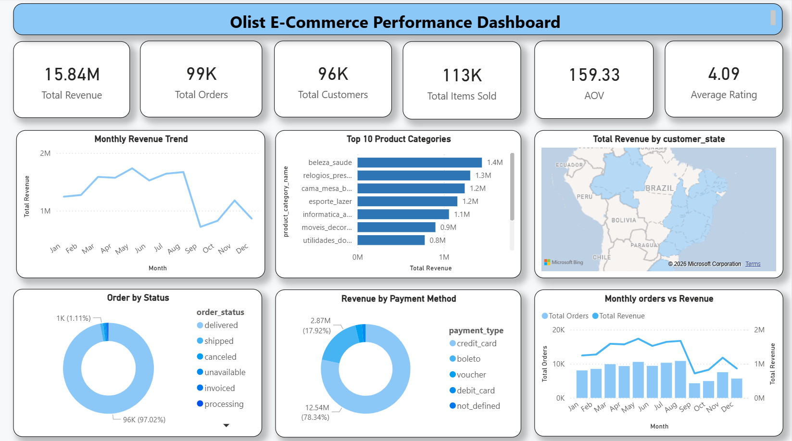
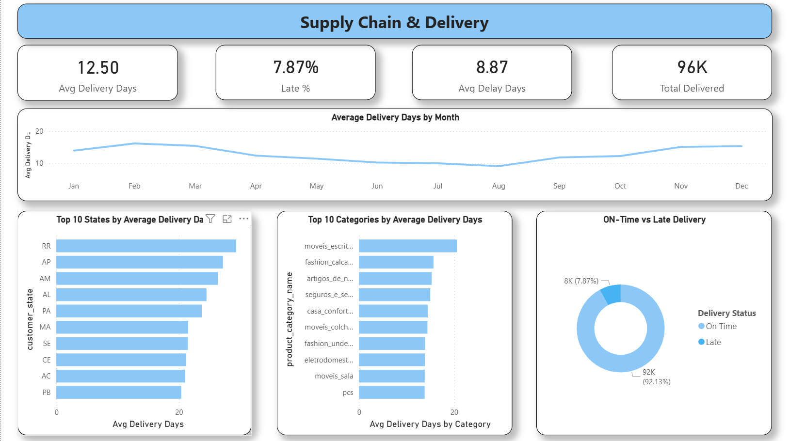
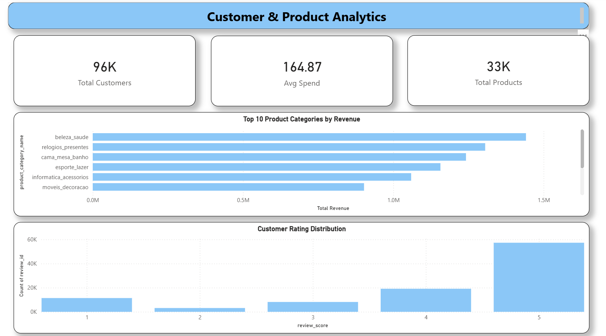

# 📊 Olist E-Commerce Analytics Dashboard
### End-to-End Business Intelligence Project | Power BI | DAX | Star Schema


<br/>

> 🚀 **Analyzed 100,000+ real orders** from Olist — Brazil's largest e-commerce marketplace — to uncover revenue trends, delivery bottlenecks, and customer behavior patterns using Power BI and DAX.

---

## 🖼️ Dashboard Preview

### 📌 Page 1 — E-Commerce Performance Overview


### 📌 Page 2 — Supply Chain & Delivery Analytics


### 📌 Page 3 — Customer & Product Analytics


---

## 🎯 Business Problem

Olist needed clarity on:
- **Where is revenue coming from?** Which categories and states drive the most sales?
- **Why are deliveries getting delayed?** Which regions and categories are underperforming?
- **Who are the customers?** What are their spending patterns and satisfaction levels?

---

## 💡 Key Business Insights & Recommendations

### 💰 Revenue
| Finding | Recommendation |
|---------|---------------|
| Beauty & Health tops revenue at R$1.85M | Increase inventory & run targeted promotions |
| Credit card = 78% of all payments | Offer credit card cashback to boost AOV |
| Revenue peaks mid-year then drops | Plan Q4 campaigns to recover lost revenue |

### 🚚 Delivery
| Finding | Recommendation |
|---------|---------------|
| 7.87% orders delivered late | Partner with faster logistics in delay-prone states |
| Northern states have highest delay | Open regional warehouses in RR, AP, AM states |
| Avg delivery = 12.5 days | Set customer expectation to 15 days to reduce complaints |

### ⭐ Customer
| Finding | Recommendation |
|---------|---------------|
| 92%+ customers rate 4-5 stars | Leverage reviews in marketing campaigns |
| Avg spend = R$164.87 per order | Introduce bundle offers to increase basket size |
| Most customers order only once | Launch loyalty program to improve retention |

---

## 📈 Key Performance Metrics

| KPI | Value | Status |
|-----|-------|--------|
| 💰 Total Revenue | R$ 15.84 Million | ✅ |
| 📦 Total Orders | 99,000+ | ✅ |
| 👥 Total Customers | 96,000+ | ✅ |
| 🛍️ Total Items Sold | 113,000+ | ✅ |
| ⭐ Average Rating | 4.09 / 5.0 | ✅ |
| 🚚 On-Time Delivery | 92.13% | ✅ |
| ⏱️ Avg Delivery Days | 12.50 days | ⚠️ |
| 💳 Credit Card Usage | 78.34% | ✅ |
| 🏆 Top Category | Beauty & Health | ✅ |
| 📉 Late Delivery Rate | 7.87% | ⚠️ |

---

## 📋 Dashboard Pages Breakdown

### 🔵 Page 1 — E-Commerce Performance Overview
- **6 KPI Cards** — Revenue, Orders, Customers, Items Sold, AOV, Rating
- **Monthly Revenue Trend** — Seasonal patterns across 12 months
- **Top 10 Product Categories** — By total revenue
- **Revenue by Payment Method** — Credit card dominates at 78%
- **Order Status Breakdown** — Delivered, shipped, cancelled analysis
- **Monthly Orders vs Revenue** — Dual axis trend comparison

### 🟢 Page 2 — Supply Chain & Delivery Analytics
- **4 KPI Cards** — Avg Delivery Days, Late %, Delay Days, Total Delivered
- **Delivery Trend by Month** — Identifying peak delay periods
- **Top 10 States by Delivery Days** — RR, AP, AM worst performers
- **Top 10 Categories by Delivery Days** — Slowest product categories
- **On-Time vs Late Delivery** — 92.13% success rate visualization

### 🟣 Page 3 — Customer & Product Analytics
- **3 KPI Cards** — Total Customers, Avg Spend, Total Products
- **Top 10 Categories by Revenue** — Best performing product lines
- **Customer Rating Distribution** — Majority rate 4-5 stars

---

## 🗂️ Data Model — Star Schema

```
                    ┌─────────────┐
                    │  DimDate    │
                    └──────┬──────┘
                           │
┌──────────────┐    ┌──────┴──────┐    ┌──────────────────┐
│ DimCustomers │────│ FactOrders  │────│  FactOrderItems  │
└──────────────┘    └──────┬──────┘    └──────────────────┘
                           │
              ┌────────────┼────────────┐
              │            │            │
       ┌──────┴───┐  ┌─────┴─────┐ ┌───┴──────────┐
       │DimSellers│  │FactPayment│ │FactReviews   │
       └──────────┘  └───────────┘ └──────────────┘
                           │
                    ┌──────┴──────┐
                    │ DimProducts │
                    └─────────────┘
```

**7 Tables | 20+ DAX Measures | 3 Dashboard Pages**

---

## 🛠️ Tools & Technologies

| Tool | Purpose |
|------|---------|
| **Power BI Desktop** | Dashboard design & interactive visualizations |
| **DAX** | 20+ custom measures & calculated columns |
| **Power Query (M)** | Data cleaning & transformation |
| **Star Schema** | Optimized data modeling for fast reporting |

---

## 📂 Project Structure

```
olist-ecommerce-dashboard/
│
├── 📊 E_Commerce_Analytics.pbix
│
├── 🖼️ page1_performance.png
├── 🖼️ page2_supply_chain.png
├── 🖼️ page3_customer_analytics.png
│
└── 📄 README.md
```

---

## 🚀 How to Run This Project

```
1. Download E_Commerce_Analytics.pbix
2. Install Power BI Desktop (free from Microsoft)
3. Open the .pbix file
4. Explore 3 interactive dashboard pages
5. Use slicers & filters for custom analysis
```

---

## 📦 Dataset

| Detail | Info |
|--------|------|
| **Source** | Kaggle — Olist Brazilian E-Commerce |
| **Link** | [Click Here](https://www.kaggle.com/datasets/olistbr/brazilian-ecommerce) |
| **Records** | 100,000+ orders |
| **Files** | 9 CSV files |
| **Period** | 2016 – 2018 |

---

## 🏆 What Makes This Project Stand Out

```
✅ Real-world dataset with 100K+ records
✅ Professional Star Schema data model
✅ 20+ DAX measures for business KPIs
✅ Actionable business recommendations
✅ 3 focused dashboard pages
✅ Clean & consistent UI design
✅ End-to-end BI project lifecycle
```

---

## 👤 About Me

**[Kapil Makode]**
Aspiring Data Analyst | Power BI | DAX | Data Modeling

[](https://linkedin.com/in/kapil-makode-2803k2004)
[](https://github.com/kapilm9399/olist-ecommerce-dashboard)
[](https://www.kaggle.com/datasets/olistbr/brazilian-ecommerce)

---

<div align="center">

### ⭐ If this project helped you, please star this repository! ⭐


</div>
